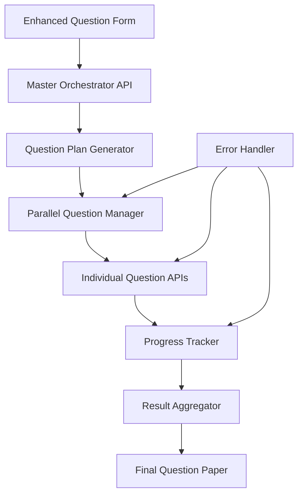

# Design Document

## Overview

The parallel question generation system addresses timeout issues by implementing a three-phase approach that breaks down question generation into smaller, manageable API calls. This design transforms the current single-call generation process into a distributed system that generates one question per API call, eliminating timeout risks while providing real-time progress feedback.

The system maintains backward compatibility with the existing question generation infrastructure while introducing new parallel processing capabilities. The design leverages the current XAI/Grok integration and extends the existing API structure to support orchestrated question generation.

## Architecture

### High-Level Flow

```
User Input → Enhanced Form → Master Orchestrator → Parallel Question Generation → Result Aggregation
```

### Three-Phase Processing Model

1. **Phase 1: Enhanced User Input**
   - Extended questionnaire with optional topic/subtopic preferences
   - Maintains existing form validation and schema structure
   - Adds new optional field for topic focus areas

2. **Phase 2: Master Orchestration**
   - Single API call to analyze requirements and create question plan
   - Generates structured plan with topic assignments for each question
   - Returns detailed specification for individual question generation

3. **Phase 3: Parallel Question Generation**
   - Individual API calls for each question based on master plan
   - Real-time progress tracking and status updates
   - Graceful error handling for individual question failures

### System Components



## Components and Interfaces

### 1. Enhanced Question Form Component

**Location**: `src/components/QuestionForm.tsx`

**Modifications**:
- Add optional "Topic/Subtopic Preferences" text input field
- Extend form validation to handle new field
- Maintain existing form structure and styling

**New Interface**:
```typescript
interface EnhancedGeneratePayload extends GeneratePayload {
  topicPreferences?: string; // Optional topic focus areas
}
```

### 2. Master Orchestrator API

**New Endpoint**: `/api/generate/plan`

**Purpose**: Analyzes user requirements and creates detailed question plan

**Input**:
```typescript
interface PlanRequest {
  exam: string;
  classStandard: '11th' | '12th';
  count: number;
  difficulty: 'Beginner' | 'Amateur' | 'Ninja';
  type: 'MCQ' | 'Subjective';
  preferredSource?: string;
  topicPreferences?: string;
  outputFormat: OutputFormat;
}
```

**Output**:
```typescript
interface QuestionPlan {
  planId: string;
  totalQuestions: number;
  questions: Array<{
    questionNumber: number;
    assignedTopic: string;
    specificFocus: string;
    difficulty: string;
    subject: string;
  }>;
  overallContext: {
    exam: string;
    classStandard: string;
    difficulty: string;
    type: string;
  };
}
```

### 3. Parallel Question Generation API

**New Endpoint**: `/api/generate/single`

**Purpose**: Generates individual questions based on master plan specifications

**Input**:
```typescript
interface SingleQuestionRequest {
  planId: string;
  questionNumber: number;
  assignedTopic: string;
  specificFocus: string;
  overallContext: {
    exam: string;
    classStandard: string;
    difficulty: string;
    type: string;
    totalQuestions: number;
  };
}
```

**Output**:
```typescript
interface SingleQuestionResponse {
  questionNumber: number;
  question: {
    id: string;
    stem: string;
    options?: string[];
    answer: string;
    explanation: string;
    difficulty: string;
    subject: string;
  };
}
```

### 4. Progress Tracking System

**New Hook**: `useParallelGeneration`

**Purpose**: Manages parallel question generation with real-time progress updates

```typescript
interface ProgressState {
  phase: 'planning' | 'generating' | 'complete' | 'error';
  planningComplete: boolean;
  questionsGenerated: number;
  totalQuestions: number;
  failedQuestions: number[];
  currentStatus: string;
}
```

### 5. Enhanced Question List Component

**Location**: `src/components/QuestionList.tsx`

**Modifications**:
- Add progress indicator during generation
- Handle partial results display
- Show failed question indicators
- Maintain existing display formats

## Data Models

### Extended Schema

```typescript
// Extend existing GeneratePayloadSchema
const EnhancedGeneratePayloadSchema = GeneratePayloadSchema.extend({
  topicPreferences: z.string().optional()
});

// New schemas for parallel processing
const QuestionPlanSchema = z.object({
  planId: z.string().uuid(),
  totalQuestions: z.number(),
  questions: z.array(z.object({
    questionNumber: z.number(),
    assignedTopic: z.string(),
    specificFocus: z.string(),
    difficulty: z.string(),
    subject: z.string()
  })),
  overallContext: z.object({
    exam: z.string(),
    classStandard: z.enum(['11th', '12th']),
    difficulty: z.enum(['Beginner', 'Amateur', 'Ninja']),
    type: z.enum(['MCQ', 'Subjective'])
  })
});

const SingleQuestionRequestSchema = z.object({
  planId: z.string().uuid(),
  questionNumber: z.number(),
  assignedTopic: z.string(),
  specificFocus: z.string(),
  overallContext: z.object({
    exam: z.string(),
    classStandard: z.enum(['11th', '12th']),
    difficulty: z.enum(['Beginner', 'Amateur', 'Ninja']),
    type: z.enum(['MCQ', 'Subjective']),
    totalQuestions: z.number()
  })
});
```

### State Management

The system will use React state management for tracking generation progress:

```typescript
interface GenerationState {
  mode: 'sequential' | 'parallel';
  plan?: QuestionPlan;
  progress: ProgressState;
  questions: Question[];
  errors: string[];
}
```

## Error Handling

### Graceful Degradation Strategy

1. **Master Orchestrator Failure**
   - Fall back to existing sequential generation method
   - Log failure for monitoring
   - Notify user of fallback mode

2. **Individual Question Failures**
   - Retry failed questions up to 2 times
   - Continue generating other questions
   - Display partial results with failure indicators
   - Allow user to retry specific failed questions

3. **Network/Timeout Issues**
   - Implement exponential backoff for retries
   - Provide clear error messages
   - Maintain progress state across failures

### Error Recovery Mechanisms

```typescript
interface ErrorRecovery {
  retryAttempts: Map<number, number>; // questionNumber -> attempts
  maxRetries: number;
  fallbackToSequential: boolean;
  partialResults: Question[];
}
```

## Testing Strategy

### Unit Tests

1. **Enhanced Form Component**
   - Test topic preferences field validation
   - Verify form submission with new field
   - Ensure backward compatibility

2. **Master Orchestrator Logic**
   - Test question plan generation
   - Verify topic distribution algorithms
   - Test preference handling

3. **Parallel Generation Manager**
   - Test concurrent API call management
   - Verify progress tracking accuracy
   - Test error handling scenarios

### Integration Tests

1. **End-to-End Parallel Flow**
   - Test complete parallel generation process
   - Verify result consistency with sequential method
   - Test various question counts and preferences

2. **Error Scenarios**
   - Test individual question failures
   - Test master orchestrator failures
   - Test network interruption recovery

3. **Performance Tests**
   - Compare parallel vs sequential generation times
   - Test concurrent load handling
   - Verify timeout elimination

### API Testing

1. **Master Orchestrator API**
   - Test plan generation with various inputs
   - Verify topic distribution logic
   - Test preference parsing and application

2. **Single Question API**
   - Test individual question generation
   - Verify context consistency
   - Test error responses

## Implementation Considerations

### Backward Compatibility

The design maintains full backward compatibility by:
- Preserving existing API endpoints
- Adding new fields as optional
- Implementing parallel generation as an enhancement, not replacement
- Providing fallback to sequential generation

### Performance Optimizations

1. **Concurrent Request Management**
   - Limit concurrent API calls to prevent rate limiting
   - Implement request queuing for large question counts
   - Use connection pooling for efficiency

2. **Caching Strategy**
   - Cache master plans for retry scenarios
   - Store partial results during generation
   - Implement client-side progress persistence

### Monitoring and Observability

1. **Metrics Collection**
   - Track parallel vs sequential generation success rates
   - Monitor individual question generation times
   - Measure user satisfaction with progress feedback

2. **Error Tracking**
   - Log master orchestrator failures
   - Track individual question failure patterns
   - Monitor fallback usage frequency

## Security Considerations

1. **Rate Limiting**
   - Implement per-user rate limits for parallel requests
   - Prevent abuse of individual question endpoints
   - Monitor for unusual request patterns

2. **Input Validation**
   - Validate all new input fields
   - Sanitize topic preferences input
   - Ensure plan IDs are properly validated

3. **Resource Management**
   - Limit maximum concurrent requests per user
   - Implement timeout controls for individual questions
   - Monitor system resource usage during parallel processing

## Migration Strategy

### Phase 1: Infrastructure Setup
- Implement new API endpoints
- Add progress tracking components
- Create parallel generation hooks

### Phase 2: Feature Integration
- Enhance question form with topic preferences
- Integrate parallel generation option
- Add progress indicators to UI

### Phase 3: Testing and Rollout
- Comprehensive testing of parallel system
- Gradual rollout with feature flags
- Monitor performance and user feedback

### Phase 4: Optimization
- Fine-tune concurrent request limits
- Optimize error handling based on real usage
- Enhance progress feedback based on user behavior