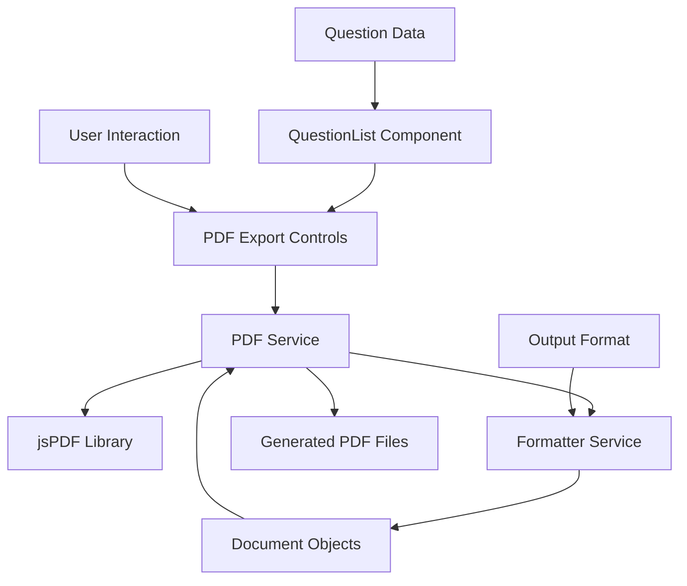

# Design Document

## Overview

The PDF export functionality will integrate seamlessly with the existing question generation system to provide users with downloadable PDF documents. The design leverages the current formatter architecture and extends it with PDF generation capabilities using jsPDF library for client-side PDF creation.

The system will provide format-aware PDF export options that respect the user's selected output format (solved examples, assignment format, or separate documents) and generate appropriately structured PDF files with professional formatting.

## Architecture

### High-Level Architecture



### Component Integration

The PDF export functionality will integrate with the existing architecture by:

1. **Extending QuestionList Component**: Add PDF export controls that appear when questions are available
2. **Leveraging Formatter Service**: Use existing `getFormatter()` function to generate structured documents
3. **Client-Side PDF Generation**: Implement PDF creation in the browser using jsPDF to avoid server-side complexity
4. **Format-Aware Export**: Provide different export options based on the selected output format

## Components and Interfaces

### PDF Service Interface

```typescript
interface PDFService {
  generatePDF(document: Document, options?: PDFOptions): Promise<void>;
  generateMultiplePDFs(documents: Document[], options?: PDFOptions): Promise<void>;
}

interface PDFOptions {
  filename?: string;
  includeHeader?: boolean;
  includeTimestamp?: boolean;
  pageFormat?: 'a4' | 'letter';
  margins?: {
    top: number;
    right: number;
    bottom: number;
    left: number;
  };
}
```

### PDF Export Controls Component

```typescript
interface PDFExportControlsProps {
  questions: Question[];
  outputFormat: OutputFormat;
  isGenerating?: boolean;
  onExportStart?: () => void;
  onExportComplete?: () => void;
  onExportError?: (error: string) => void;
}
```

### Enhanced Document Schema

The existing `Document` schema will be extended with PDF-specific metadata:

```typescript
interface PDFDocument extends Document {
  metadata?: {
    filename: string;
    timestamp: string;
    pageCount?: number;
  };
}
```

## Data Models

### PDF Generation Request

```typescript
interface PDFGenerationRequest {
  documents: Document[];
  format: OutputFormat;
  options: PDFOptions;
  timestamp: string;
}
```

### PDF Export State

```typescript
interface PDFExportState {
  isGenerating: boolean;
  progress?: number;
  error?: string;
  lastExportTimestamp?: string;
}
```

## Error Handling

### Error Types

1. **PDF Generation Errors**: Issues with jsPDF library or document processing
2. **Browser Compatibility Errors**: Unsupported browser features
3. **File System Errors**: Download failures or permission issues
4. **Content Formatting Errors**: Issues with mathematical expressions or special characters

### Error Recovery Strategy

- **Graceful Degradation**: Provide fallback options if PDF generation fails
- **User Feedback**: Clear error messages with actionable suggestions
- **Retry Mechanism**: Allow users to retry failed exports
- **Logging**: Capture errors for debugging without exposing sensitive information

### Error Handling Implementation

```typescript
class PDFExportError extends Error {
  constructor(
    message: string,
    public code: 'GENERATION_FAILED' | 'DOWNLOAD_FAILED' | 'BROWSER_UNSUPPORTED',
    public details?: any
  ) {
    super(message);
    this.name = 'PDFExportError';
  }
}
```

## Testing Strategy

### Unit Testing

1. **PDF Service Tests**: Test PDF generation with various document types and formats
2. **Component Tests**: Test PDF export controls rendering and user interactions
3. **Formatter Integration Tests**: Ensure PDF service works correctly with existing formatters
4. **Error Handling Tests**: Test error scenarios and recovery mechanisms

### Integration Testing

1. **End-to-End Export Flow**: Test complete export process from question generation to PDF download
2. **Format-Specific Tests**: Test each output format (solved examples, assignment, separate documents)
3. **Browser Compatibility Tests**: Test across different browsers and devices
4. **File Generation Tests**: Verify PDF file structure and content accuracy

### Test Data Strategy

- **Mock Question Data**: Use consistent test questions with various complexity levels
- **Mathematical Content**: Test PDF generation with mathematical expressions and special characters
- **Large Document Tests**: Test performance with large numbers of questions
- **Edge Cases**: Test with empty questions, missing data, and malformed content

### Testing Tools

- **Jest**: Unit and integration testing
- **React Testing Library**: Component testing
- **PDF Parsing Libraries**: Verify generated PDF content in tests
- **Mock Browser APIs**: Test download functionality

## Implementation Considerations

### Library Selection

**jsPDF** was chosen for PDF generation because:
- Client-side generation reduces server load
- No additional backend infrastructure required
- Good support for text formatting and mathematical content
- Active maintenance and community support
- Compatible with existing React/Next.js architecture

### Performance Optimization

1. **Lazy Loading**: Load jsPDF library only when PDF export is requested
2. **Chunked Processing**: Process large documents in chunks to prevent UI blocking
3. **Progress Indicators**: Show progress for long-running PDF generation
4. **Memory Management**: Clean up resources after PDF generation

### Browser Compatibility

- **Modern Browser Support**: Target browsers with ES6+ support
- **Download API**: Use modern download APIs with fallbacks
- **File System Access**: Handle different browser download behaviors
- **Mobile Considerations**: Ensure PDF export works on mobile devices

### Security Considerations

1. **Client-Side Processing**: All PDF generation happens in the browser
2. **No Data Transmission**: Question data never leaves the client for PDF generation
3. **File Naming**: Sanitize filenames to prevent security issues
4. **Content Validation**: Validate document content before PDF generation

### Accessibility

1. **Keyboard Navigation**: Ensure PDF export controls are keyboard accessible
2. **Screen Reader Support**: Provide appropriate ARIA labels and descriptions
3. **Visual Indicators**: Clear visual feedback for export status
4. **Alternative Formats**: Consider providing alternative export formats for accessibility