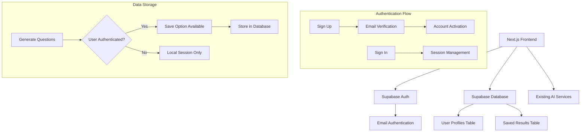

# Design Document

## Overview

This design implements Supabase-based authentication and data storage for the learning assistant application. The system will use Supabase Auth for email-based user authentication and Supabase Database for storing user-generated question sets. The design maintains backward compatibility by allowing unauthenticated users to continue using the application's core features while providing enhanced functionality for authenticated users.

## Architecture

### High-Level Architecture



### Component Architecture

The system will be organized into the following layers:

1. **Authentication Layer**: Handles user registration, login, and session management
2. **Data Access Layer**: Manages database operations for user data and saved results
3. **UI Layer**: Provides authentication forms and saved results management interfaces
4. **Integration Layer**: Connects authentication state with existing application features

## Components and Interfaces

### Authentication Components

#### AuthProvider
- **Purpose**: Context provider for authentication state management
- **Responsibilities**: 
  - Manage user session state
  - Provide authentication methods (signUp, signIn, signOut)
  - Handle authentication state changes
- **Interface**:
```typescript
interface AuthContextType {
  user: User | null;
  loading: boolean;
  signUp: (email: string, password: string) => Promise<void>;
  signIn: (email: string, password: string) => Promise<void>;
  signOut: () => Promise<void>;
  resetPassword: (email: string) => Promise<void>;
}
```

#### AuthForms
- **SignUpForm**: Email and password registration form
- **SignInForm**: Email and password login form
- **ResetPasswordForm**: Password reset request form

### Data Management Components

#### SavedResultsService
- **Purpose**: Handle CRUD operations for saved question sets
- **Interface**:
```typescript
interface SavedResultsService {
  saveResults: (results: SaveResultsPayload) => Promise<SavedResult>;
  getUserResults: (userId: string) => Promise<SavedResult[]>;
  getResultById: (id: string) => Promise<SavedResult>;
  deleteResult: (id: string) => Promise<void>;
}
```

#### SavedResultsList
- **Purpose**: Display and manage user's saved results
- **Features**:
  - List view with title, date, and preview
  - Delete functionality with confirmation
  - Load and display full results

### Integration Components

#### SaveResultsButton
- **Purpose**: Conditional save button that appears after question generation
- **Behavior**: Only visible to authenticated users

#### AuthGuard
- **Purpose**: Protect routes that require authentication
- **Behavior**: Redirect unauthenticated users to sign-in

## Data Models

### Database Schema

#### users table (managed by Supabase Auth)
```sql
-- This table is automatically created by Supabase Auth
-- We'll extend it with a profiles table for additional user data
```

#### profiles table
```sql
CREATE TABLE profiles (
  id UUID REFERENCES auth.users(id) ON DELETE CASCADE PRIMARY KEY,
  email TEXT NOT NULL,
  created_at TIMESTAMP WITH TIME ZONE DEFAULT NOW(),
  updated_at TIMESTAMP WITH TIME ZONE DEFAULT NOW()
);
```

#### saved_results table
```sql
CREATE TABLE saved_results (
  id UUID DEFAULT gen_random_uuid() PRIMARY KEY,
  user_id UUID REFERENCES auth.users(id) ON DELETE CASCADE NOT NULL,
  title TEXT NOT NULL,
  questions JSONB NOT NULL,
  metadata JSONB NOT NULL,
  created_at TIMESTAMP WITH TIME ZONE DEFAULT NOW(),
  updated_at TIMESTAMP WITH TIME ZONE DEFAULT NOW()
);
```

### TypeScript Interfaces

#### SavedResult
```typescript
interface SavedResult {
  id: string;
  user_id: string;
  title: string;
  questions: Question[];
  metadata: {
    exam: string;
    classStandard: string;
    difficulty: string;
    type: string;
    outputFormat: OutputFormat;
    questionCount: number;
  };
  created_at: string;
  updated_at: string;
}
```

#### SaveResultsPayload
```typescript
interface SaveResultsPayload {
  title: string;
  questions: Question[];
  metadata: {
    exam: string;
    classStandard: string;
    difficulty: string;
    type: string;
    outputFormat: OutputFormat;
  };
}
```

## Error Handling

### Authentication Errors
- **Invalid credentials**: Display user-friendly error messages
- **Network errors**: Provide retry mechanisms and offline indicators
- **Email verification**: Clear instructions and resend options
- **Password requirements**: Real-time validation feedback

### Database Errors
- **Save failures**: Graceful degradation with local storage fallback
- **Load failures**: Error boundaries with retry options
- **Connection issues**: Offline mode indicators

### Error Boundaries
- Implement React Error Boundaries for authentication components
- Provide fallback UI for critical failures
- Log errors for debugging while maintaining user privacy

## Testing Strategy

### Unit Tests
- Authentication service methods
- Database service operations
- Form validation logic
- Error handling scenarios

### Integration Tests
- Authentication flow end-to-end
- Save and retrieve results workflow
- Unauthenticated user experience
- Database schema validation

### Component Tests
- Authentication forms rendering and interaction
- Saved results list functionality
- Conditional UI elements based on auth state
- Error state handling

### E2E Tests
- Complete user registration and login flow
- Generate questions → save → retrieve workflow
- Password reset functionality
- Cross-browser authentication persistence

## Security Considerations

### Authentication Security
- Use Supabase's built-in security features
- Implement proper session management
- Secure password requirements (minimum 8 characters)
- Email verification for account activation

### Data Security
- Row Level Security (RLS) policies for user data isolation
- Validate all user inputs on both client and server
- Sanitize data before database storage
- Implement proper CORS policies

### Privacy
- Store minimal user data (email only)
- Provide clear data usage policies
- Allow users to delete their accounts and data
- Comply with data protection regulations

## Performance Considerations

### Authentication
- Implement session caching to reduce auth checks
- Use Supabase's built-in session management
- Lazy load authentication-dependent components

### Data Loading
- Implement pagination for saved results lists
- Use optimistic updates for better UX
- Cache frequently accessed data
- Implement proper loading states

### Bundle Size
- Code-split authentication components
- Lazy load Supabase client
- Tree-shake unused Supabase features